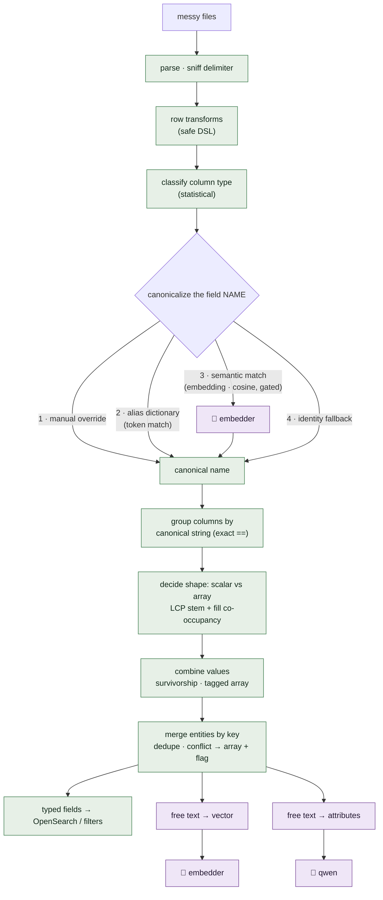

# unfuckdoc

Turn a pile of **messy, differently-shaped files** into one **unified, searchable, segmentable
entity store** — with a **deterministic-first** engine and **gated, self-hosted open models**.

> **Continuing in Claude Code?** Read `CLAUDE.md` first — project context, current state, next steps.

You dump CSVs (even with different column names, partial fields, duplicate people); it standardises
each column to a **canonical field**, **merges** records that share a key into one entity, and makes
the result filterable by **tags, ranges, geo, and meaning**. Fuzzy questions use **vector search**;
logic and negation ("no garden") use **LLM-extracted structured attributes**; everything expensive is
**gated** so the common path is cheap and deterministic.

## Two apps (+ a reference POC)

| Dir | What | Stack |
|---|---|---|
| **`server-kt/`** | the engine + API (go-forward backend) | Kotlin · Ktor · Guice · OpenSearch · DJL |
| **`web/`** | the UI (SSR) | React Router v7 · TypeScript |
| `src/` | the original Python POC (reference only — not extended) | pandas · scikit-learn |

## The collection workflow

A **collection** is the unit of work — dump files, get one deduped, standardised, queryable set:

```
① Sources    dump files → merge/dedup entities by a key (email/id/…)
② Canonical  standardise columns → your unified fields · transforms · custom canonicals · LLM attributes
③ Enrich     join other collections/files on a shared field to gain their fields (1:1 / 1:many)
④ Explore    search · tags · ranges · geo (map) · semantic · saved segments
```

## The four ways a field is produced (one engine, four methods)

| Method | For | Model? |
|---|---|---|
| **Deterministic** — classify types, canonicalize names (alias dict + semantic), merge/dedup, safe-DSL **transforms** | structure, cleaning, unification | no |
| **Vectors** — embed free text, kNN/cosine semantic search | tagging / "similar by meaning" | embedder (nomic / MiniLM) |
| **LLM** — read text → structured attributes / judgment (handles negation, reasoning) | logic the vectors can't do | LLM (qwen2.5) |
| *(planned)* **Aggregate** — group one-to-many → counts/sums/ratios | scores | no |

**Guiding principle: deterministic-first, models only on the ambiguous residual, always gated + counted.**

## How unification works (and where the model actually is)

A column merges with another **only if it resolves to the same canonical name**. That name is decided
by a 4-tier, first-match-wins, **type-gated** cascade — and **only one tier uses a model**: the
semantic field-*name* match (embed the name, cosine to the nearest type-compatible canonical). The
**`Consolidator` uses no model at all** — it groups columns by exact canonical-string equality, then
decides scalar-vs-array by **string prefix/suffix + fill co-occupancy statistics**, and combines
values by **exact dedup + survivorship**. (Its internal `style="semantic"` is a naming clash — it just
means the slot labels are words like `Work`/`Home`, not embeddings.)



**Green = deterministic (no model). Purple = model.** The embedder is used *once on the field name*
(the ambiguous residual the dictionary can't place) and *once on free text* (for vector search); the
LLM is used only for structured attribute extraction. The merge itself — grouping, shape, value
combination, entity dedup — is pure statistics, reproducible, and model-free.

**Shape decision (scalar vs array), in one line:** columns that fill *different* cells in the *same*
row are **slots** → array (`Mobile`/`Work`/`Home Phone` → `phone: [{type,value}…]`); columns that fill
the *same* cell from *different* sources are **synonyms** → scalar (`Email`/`work_email` → one `email`).
Conflicting scalar values across the same entity key are **collected into an array and flagged**, never
silently dropped.

## Quickstart (all local, all free models)

> Detailed step-by-step (prerequisites, Ollama, env vars, troubleshooting): **[`SETUP.md`](SETUP.md)**.

```bash
# 1. OpenSearch (index) — single-node dev cluster
docker compose up -d                               # :9200, security off (dev only)

# 2. models via Ollama (Apple Silicon: run natively for Metal GPU)
brew install ollama && brew services start ollama
ollama pull nomic-embed-text                        # embeddings (semantic search)
ollama pull qwen2.5:7b                               # LLM (attribute extraction / reasoning)

# 3. backend — wire both models via env (else in-process MiniLM + no LLM)
cd server-kt && PORT=8080 \
  EMBED_BASE_URL=http://localhost:11434/v1 EMBED_MODEL=nomic-embed-text \
  LLM_BASE_URL=http://localhost:11434/v1   LLM_MODEL=qwen2.5:7b \
  ./gradlew run                                      # http://localhost:8080

# 4. frontend
cd web && npm install && npm run dev                 # http://localhost:3000  → talks to :8080
```

Open **http://localhost:3000/collections**, create a collection, and dump a file from `data/samples/`.

## Search modes

- **Keyword** — punctuation/order-independent term match.
- **Tags / enumeration** — two-stage: pick field(s) → pick values (low-card keyword/boolean fields).
- **Ranges** — numeric/date (`>100000`, `2024-01-01..2024-06-30`).
- **Geo** — `geo_point` fields; draw a rectangle/polygon on a Leaflet map, or bbox filter.
- **Semantic** — vector cosine over free text; results show a per-row **relevance bar**.

## Models & config

Both models sit behind one interface each, chosen by env var — any OpenAI-compatible endpoint (local
Ollama, **OVH AI Endpoints** (EU), vLLM, OpenRouter):

| Env | Effect |
|---|---|
| `EMBED_BASE_URL` / `EMBED_MODEL` | remote embedder (else in-process `all-MiniLM-L6-v2` via DJL) |
| `LLM_BASE_URL` / `LLM_MODEL` | enable the LLM (else extraction is off) |
| `UNFUCK_NO_EMBED=1` | disable embeddings entirely (deterministic-only) |

See `docs/model_inference_flow.pdf` for exactly when/where each model runs.

## Docs

`docs/` — `platform_expansion_plan.md` (JSON/SQL sources, multi-tenancy, export), `benchmark.md`
(canonical-inference accuracy harness), `model_inference_flow.pdf`, plus the original design docs
(`FINDINGS.md`, `ingestion_plan`, `interoperability_reliability_layer`).

## License

MIT.
