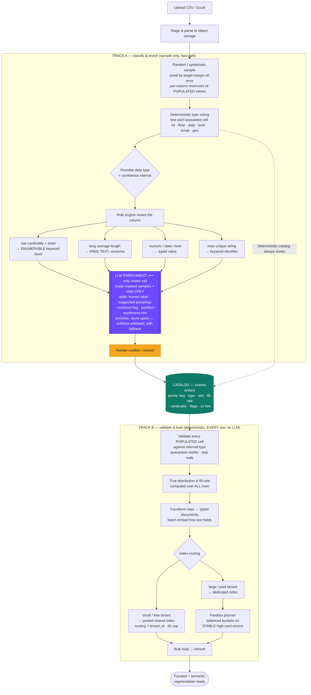

# Adaptive Ingestion & Segmentation Pipeline — Plan

A platform where a customer uploads arbitrary tabular data about people or companies, and the system automatically makes it searchable and segmentable — no schema definitions, no manual indexing. The differentiator is the **inference-and-segmentation layer**, not the storage underneath.

This document describes the two-track design and marks exactly where an LLM is (and is not) used.

---

## Core principle

> **Deterministic for correctness · sample for classification · LLM for meaning · human for trust · full-scan for validation.**

The pipeline splits into two tracks that meet at one shared artifact, the **catalog**:

- **Track A — Sample track.** A small *random* sample is classified deterministically, then an LLM enriches it with *meaning* (labels, groupings, "is this semantically searchable?"). Fast, cheap, runs once per upload. **The LLM only ever sees the sample.**
- **Track B — Full ingestion.** Every row is validated against the inferred types, junk is quarantined, true distributions are computed, documents are built and loaded. **Fully deterministic — no LLM anywhere on this path.**

The critical boundary: **the LLM operates on a random sample and only for interpretation; the machine that actually ingests, validates, and indexes millions of rows never calls a model.** If the LLM is slow, wrong, or down, a fully working faceted product still ships from the deterministic path.

---

## Flow diagram — where LLM inference matters

The single LLM node is highlighted. Everything else is deterministic code.



**Legend.** Purple = the sole LLM call (sample + stats only). Amber = human confirmation (source of truth). Green = the shared catalog. Everything else is deterministic code. Note the dotted line: the deterministic pass alone produces a working catalog, so the LLM is strictly additive.

---

## Track A — Inference on a random sample

### A0 · Stage & parse
Accept the file, assign `upload_id` + `tenant_id`, parse to rows/columns, land in object storage. Deterministic document IDs (`upload_id` + row key) make the whole pipeline idempotent and re-runnable. Nothing touches the search index yet — **ingestion is decoupled from indexing.**

### A1 · Random sample, sized by confidence
Draw a **random or systematic** sample across the *entire* file (never the first-N — uploads are often sorted, which biases the head). Size it to a **target number of populated values** (~1,000–2,000 per column), not a flat percentage, because sampling error depends on sample size, not dataset size. For sparse columns, keep filling a per-column **reservoir** until it has enough non-null values.

### A2 · Deterministic type voting → possible data type
Every sampled *populated* cell is tested against detectors (int, float, date, bool, email, geo, currency…). Votes are tallied **over populated cells only** — nulls never enter the denominator. Output per column: a dominant type, a **confidence interval** ("date, 96% ± 2%"), and a stat block (cardinality, avg length, samples).

> **Example — the `Age` column.** The sample holds `["39", "21", "55", "N/A", "44", "", "63", ...]`. Voting over the populated cells: 96% parse as integer, 4% don't (`"N/A"`, `"unknown"`). 96% clears the ≥90% threshold → **verdict: integer**, and the 4% are marked as cells to quarantine in Track B. The empty strings were never counted — they're nulls, not junk.

> **Example — `Bio`.** Sample cardinality 49 of 50, average length **60.9 characters**. High length beats the low-cardinality signal → **verdict: free_text, vectorise = true**. (First POC run got this wrong — it saw low cardinality first and mislabeled it enumerable. The fix, "long average length wins," is why this rule ordering exists.)

### A3 · Rule engine → route
The type + stats deterministically route each column:

| Signal | Route | OpenSearch |
|---|---|---|
| low cardinality **and** short values | **enumerable → keyword facet** | `keyword` |
| long average string length | **free text → vectorise (semantic)** | `text` + `knn_vector` |
| numeric | store number | `long` / `double` |
| parses as date / bool / email | typed slot | `date` / `boolean` / `keyword` |
| near-unique string | keyword identifier | `keyword` |

Long average length wins over cardinality — repeated-but-long values are still prose.

> **Example — a 10-column upload routed.** The demo `people.csv` resolves as:
>
> | Column | Verdict | Route |
> |---|---|---|
> | `Full Name` | keyword | identifier (near-unique) |
> | `Email` | email | keyword |
> | `Age` | integer | store number |
> | `Annual Revenue` | float | store number |
> | `Sign Up Date` | date | store date |
> | `Is Active` | boolean | store boolean |
> | `Plan` | categorical (3 values) | enumerable → keyword facet |
> | `Country` | categorical | enumerable → keyword facet |
> | `Industry` | categorical | enumerable → keyword facet |
> | `Bio` | free_text (avg len 61) | vectorise → semantic search |

### A4 · LLM enrichment — **the only model call, sample only**
Runs **asynchronously, on the sample's stats and masked samples — never raw data, never the full set.** It adds *meaning* the deterministic pass can't:

- human-friendly labels ("Sign-up date")
- suggested groupings / roll-ups (40 job titles → 5 role families; age brackets named against **real** quantiles)
- which free-text fields are semantically meaningful → the `vectorise` flag
- partition-worthiness hints for enums

Guardrails: **enriches, never gates** (a working catalog exists without it); returns **schema-validated JSON** constrained to catalog slots; **falls back** to the deterministic entry on timeout or invalid output; **PII masked** before the call. Runs **once per upload**, never per query.

> **Example — what the LLM sees vs. returns.** It never receives raw rows. It receives the deterministic profile plus masked samples:
>
> ```json
> // INPUT to the model (masked samples + stats only)
> { "column": "job_title", "detected_type": "string", "cardinality": 41,
>   "avg_len": 14.2, "distinct_ratio": 0.10,
>   "sample_values": ["Senior Backend Engineer", "AE", "SDR", "Backend Eng",
>                     "Account Executive", "Staff SWE", "Sales Development Rep"] }
> ```
> ```json
> // OUTPUT from the model (schema-validated, maps onto catalog slots)
> { "key": "job_title", "label": "Job title", "slot": "str",
>   "facet_ui": "checkbox_list", "vectorize": false,
>   "suggested_grouping": { "type": "categorical_rollup", "buckets": {
>     "Engineering": ["Senior Backend Engineer", "Backend Eng", "Staff SWE"],
>     "Sales":       ["AE", "SDR", "Account Executive", "Sales Development Rep"] } } }
> ```
>
> The model's value-add is the **roll-up** — collapsing 41 raw titles into role families no type detector could infer. If this call fails, the column still ships as a plain `keyword` facet from the deterministic pass; only the grouping is lost.

> **Example — `Bio`.** Input: `avg_len 61`, `distinct_ratio 0.98`, masked samples of prose. Output: `{ "label": "Profile bio", "vectorize": true, "facet_ui": "search_box" }` — the model confirms the free-text column is semantically meaningful and worth embedding.

### A5 · Human confirmation — source of truth
The user renames facets, overrides types, accepts/rejects groupings, un-quarantines columns. Their edits **pin the schema**; re-inference never overwrites a correction. Aggregated corrections across tenants are the signal for improving prompts over time.

---

## Track B — Full ingestion (deterministic, every row)

No LLM on this path. It runs over the whole dataset.

### B1 · Full-set junk quarantine
The sample classifies; the **full scan validates.** Every *populated* cell is checked against the inferred type — misfits are **quarantined** (never silently dropped), rows with too many misfits are held for review. **Nulls are skipped entirely** — for a 99%-null column that means touching 1% of rows.

### B2 · True distribution & fill-rate
Recompute **real** cardinality and value distribution over all rows (the sample distorts exactly these numbers). Record **fill-rate** (populated ÷ total) as column metadata — it never affects typing, but it keeps segment math honest ("12k of the 40k people who *have* a job_title", not 12k of 10M). A 3%-filled column is a first-class field, just annotated.

> **Example — a sparse column at scale.** `job_title` in a 10,000,000-row upload is populated in only 310,000 rows. A naive 5% row-sample sees ~15,500 of them — but a poorly-designed sampler could see almost none of a 0.5% column and skip it. The reservoir approach keeps sampling until it has ~1,500 *populated* `job_title` values, types it confidently, and records `fill_rate: 0.031`. Downstream, a segment reads *"12,400 of 310,000 people with a job_title are in Engineering"* — never *"12,400 of 10M."*

> **Example — cardinality corrected on the full pass.** `Country` looked like a high-card keyword to the 50-row sample (distinct ratio ~0.6 in the sample). Over the full 20,000 rows its real distinct ratio is 0.0015 (30 values). The full-set recompute reclassifies it as a genuine enumerable — which is what later makes it a partition candidate. Sample distorts cardinality; the scan fixes it.

### B3 · Transform → typed documents (+ embeddings)
Build each clean row into its document (nested typed pairs for pooled, flat typed fields for dedicated). For `vectorise` columns, call the embedding model in **batches** (the expensive, latency-heavy step — never per-row, never in the hot path).

### B4 · Index routing (pool vs. silo)
Cost tracks **shard count, not data volume.** So:

- **small / free tenants → one pooled shared index** (`tenant_id` + custom routing + document-level security), 5,000-entry hard cap enforced by an atomic counter.
- **large / paid tenants → their own dedicated index** (custom mappings, longer retention, own SLA).

One shared index for the many, a dedicated index only for the few — never one index per tenant.

### B5 · Partition planner (large tenants only)
For big dedicated indices, partition on a **stable, high-cardinality, frequently-filtered** enum — computed from the full-set histogram:

- **never one shard per value** — bin-pack values into N **balanced** buckets so a hot value can't hotspot;
- **stable keys only** — a mutable shard key turns every value change into a cross-partition migration;
- decision driven by the catalog's own cardinality / skew / churn / query-frequency stats.

> **Example — real planner output on 20,000 rows.**
>
> | Column | Card. | Top-1 share | Stability | Verdict |
> |---|---|---|---|---|
> | `Full Name` | 20000 | — | stable | ✗ facet only (near-unique, ratio 1.0) |
> | `Email` | 20000 | — | stable | ✗ facet only (near-unique) |
> | `Plan` | 3 | 82% | **mutable** | ✗ facet only (low cardinality **and** mutable) |
> | `Country` | 30 | 34% (US) | stable | ✓ **partition key** |
> | `Industry` | 12 | 9% | stable | ✓ **partition key** |
>
> `Plan` is the instructive rejection: even ignoring its low cardinality, it's **mutable** — a free→pro change would force a document to migrate partitions, so it's disqualified on stability alone.

> **Example — bin-packing `Country` (hot value handled).** 30 values, `US` = 34%. Packed into 4 **balanced** buckets, `US` gets its **own** bucket rather than hotspotting a shared one:
>
> | Bucket | Rows | Share | Values |
> |---|---|---|---|
> | 0 | 6,842 | 34.2% | `US` (alone) |
> | 1 | 4,391 | 22.0% | `IN`, `FR`, `ES`, `SE`, `XB`, `XD`, … (9) |
> | 2 | 4,394 | 22.0% | `UK`, `ZA`, `AU`, `IT`, `PL`, `XM`, … (10) |
> | 3 | 4,373 | 21.9% | `DE`, `BR`, `CA`, `NL`, `MX`, `XE`, … (10) |
>
> Balance ratio **1.56** (heaviest ÷ lightest) — imperfect only because `US` alone exceeds a fair 25% share and can't be split. By contrast `Industry` (12 uniform values) packs into 4 buckets at balance **1.00**. Emitted plan: `{ "strategy": "index_per_bucket", "index_pattern": "{tenant}__country__b{bucket}", "value_to_bucket": { "US": 0, "IN": 1, "UK": 2, "DE": 3, ... } }`. Had `US` exceeded 60%, the planner would instead flag `routing_partition_size` to spread the hot value across several shards.

### B6 · Bulk load → searchable
`_bulk` the docs, ~1s refresh makes them searchable, commit the catalog. The query builder can now list the new searchable keys — auto-indexed params, no rebuild.

---

## Where the LLM is — and isn't

| Step | Uses LLM? | Operates on | Purpose |
|---|---|---|---|
| A1 sample | no | — | draw representative rows |
| A2 type voting | **no** | sample (populated cells) | correctness — what type is this? |
| A3 rule routing | **no** | sample stats | deterministic column routing |
| **A4 enrichment** | **YES** | **sample stats + masked samples only** | **meaning — labels, groupings, vectorise flag** |
| A5 human confirm | no | catalog | trust — pin the schema |
| B1–B6 full ingestion | **no** | **every row** | validate, transform, embed, route, load |

The LLM touches a **sample**, adds **interpretation**, and **cannot block ingestion**. The machine that processes millions of rows is entirely deterministic.

---

## The catalog (the actual IP)

Both tracks converge on one engine-agnostic artifact. Every column becomes a **point**:

```json
{
  "key": "job_title",
  "type": "categorical",
  "slot": "str",
  "os_type": "keyword",
  "fill_rate": 0.031,
  "populated_count": 310000,
  "cardinality": 4821,
  "type_fit": 0.94,
  "confidence": "high",
  "label": "Job title",
  "facet_ui": "checkbox_list",
  "vectorize": false,
  "partition_candidate": false,
  "searchable": true
}
```

It powers the self-configuring query builder, drives the free→paid tier-migration transform (the catalog *is* the migration blueprint — it already knows each field's type), and stays constant while storage underneath changes. Deterministic fields come from Tracks A2/B2; `label` and grouping fields come from A4; type/fill-rate refinements come from B2.

---

## Worked example — one upload, traced end to end

A customer uploads `people.csv` (20,000 rows, 10 columns). Following one column of each kind:

**1 · Sample.** A random sample of populated values is drawn per column (floor applied because 5% of some columns is thin).

**2 · Classify (deterministic).** `Age` → integer (96% fit, 4% `"N/A"` flagged). `Annual Revenue` → double. `Sign Up Date` → date. `Is Active` → boolean. `Plan` → keyword facet (3 values). `Bio` → free_text (avg len 61 → vectorise). `Email` → keyword identifier.

**3 · Enrich (LLM, sample only).** Labels added (`"Sign-up date"`, `"Profile bio"`); `Bio` confirmed `vectorize: true`; `Industry` gets a suggested sector roll-up. If the model is down, steps 1–2 already produced a working catalog.

**4 · Confirm (human).** The user renames a facet and accepts the `Bio` vectorisation. Edits pin the schema.

**5 · Validate & load (deterministic, all 20,000 rows).** Every `Age` cell is re-checked; the `"N/A"` rows have that one field quarantined (row kept). True distributions computed — `Country` reclassified from apparent high-card keyword to a real 30-value enumerable. Rows transformed to typed documents; `Bio` batch-embedded.

**6 · Route & partition.** This tenant is large → dedicated index. Planner marks `Country` and `Industry` as partition keys, `Plan` rejected (mutable). `Country` bin-packed into 4 balanced buckets.

**7 · Result — one document, fully typed and searchable:**

```json
{
  "tenant_id": "t_demo",
  "full_name": "user1",
  "email": "user1@example.com",
  "age": 39,
  "annual_revenue": 1974722.66,
  "sign_up_date": "2026-01-03",
  "is_active": true,
  "plan": "pro",
  "country": "IN",
  "industry": "SaaS",
  "bio": "Startup founder into NLP and search and slow mornings.",
  "bio_vector": [0.04744, -0.03378, -0.08611, "… 384 dims"]
}
```

From this the customer can immediately: filter `plan = pro AND age > 30` (typed facets), break a segment down by `country` (aggregation, pruned to the right partition bucket), and run *"founders interested in machine learning"* as a semantic query against `bio_vector` — none of which they had to configure.

---

## Guardrails recap

- **Ingest decoupled from indexing** — raw rows land cheap; nothing indexed until types are decided.
- **Sample to classify, scan to validate** — sampling error depends on sample size, not dataset size; junk-finding needs the full set.
- **Nulls are coverage, not signal** — fill-rate is metadata; typing runs on populated cells only.
- **LLM enriches, never gates** — deterministic path always yields a working catalog; the model is additive and sees only masked samples.
- **Cheap mutations** — a tag change reindexes one document (immutable Lucene segments), never the index.
- **Pool the many, dedicate the few** — cost tracks shard count; partition only on stable enums, in balanced buckets.
- **Human corrections are source of truth** — re-inference never overwrites them.
