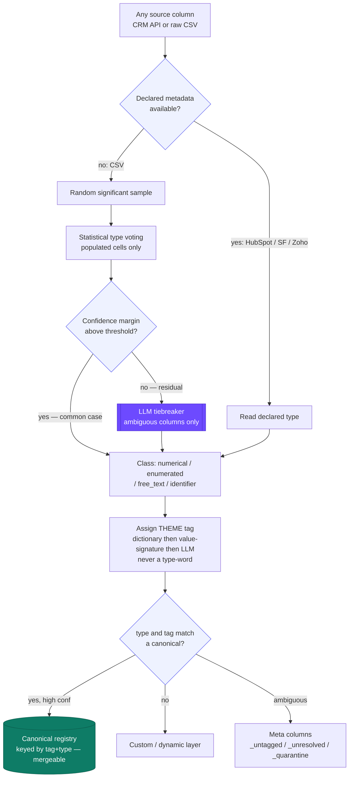
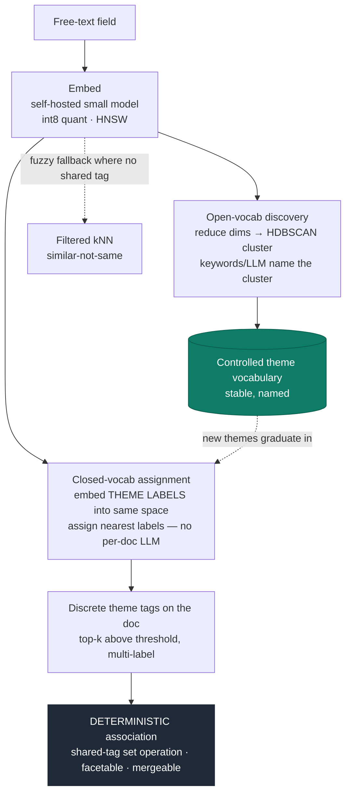

# Source Interoperability, Classification & Reliability Layer

Companion to the *Adaptive Ingestion & Segmentation Pipeline* plan. That document covers
turning one upload into searchable, segmentable data. **This** document covers the layer above
it: ingesting from **many heterogeneous sources** (HubSpot, Salesforce, Zoho, raw CSV…),
classifying every column, tagging it by *theme*, merging equivalent fields across sources,
handling ambiguity and outliers, scoring how much to trust each source — down to the
individual field — and finally turning **unstructured free text into the same deterministic,
mergeable tags** as everything else (§10–11).

**Governing idea:** classify by statistics, tag by meaning, merge on *type ∩ theme*, escalate
to an LLM only on the ambiguous residual, and never force a confident answer where there
isn't one — a `null` is cheaper than a confident lie.

### Flow — from any column to a canonical, mergeable field



---

## Cost map — steps rated 0–10

Relative compute/operational cost of each step (0 = negligible, 10 = the heaviest step in
this pipeline). Ratings are for the *ongoing per-record / per-upload* path unless noted; the
LLM-escalation costs apply only to the small ambiguous residual, not the common case.

| Step | Cost /10 | Driver |
|---|---|---|
| 1 · Read metadata / infer | **1** | one-time schema read; sample inference |
| 2 · Canonical mapping | **1** | alias lookups |
| 3 · Classification | **2** (LLM residual 6) | statistical voting on a sample |
| 4 · Tagging | **2** (LLM residual 6) | dictionary + signature first |
| 5 · Field merge | **4** | value-overlap + embedding match |
| 6 · Outliers / validation | **3** | full-set pass, cheap per cell |
| 7 · Meta columns | **1** | storage only |
| 8 · Source reliability | **1** | roll-up of existing stats |
| 9 · Reliability matrix | **2** | per-field survivorship at merge time |
| 10 · Embeddings / vectors | **8** | RAM of the HNSW index (SaaS *generation* is ~1: ¢-cheap; see §10) |
| 11 · Theme extraction | **5** | assignment cheap; HDBSCAN periodic |

The takeaway: **everything except embeddings (§10) is cheap and deterministic.** The two cost
peaks are the embedding step and the rare LLM escalations — both deliberately bounded (embeddings
gated to paid + quantized; LLM only on the low-confidence residual).

---

## 1. Read the schema — don't only infer it

**Cost: 1/10** — a one-time metadata read per source schema; sample-based inference touches only a sample.

Raw CSV must be inferred. But CRMs **declare** their field metadata, so read it first and
infer only as fallback.

- **HubSpot** — Properties API returns `type` (`string`, `number`, `date`, `datetime`,
  `enumeration`, `bool`) + `fieldType` (`text`, `select`, `checkbox`, `date`, …). Custom
  properties come through the same API; canonical identities are `email`, `domain`, `hs_object_id`.
- **Salesforce** — `describeSObject` returns each field's `type` (`string`, `boolean`, `double`,
  `currency`, `date`, `datetime`, `email`, `phone`, `url`, `picklist`, `multipicklist`,
  `reference`, `textarea`, `percent`…). Custom fields are suffixed `__c`; picklists expose value sets.
- **Zoho** — Fields Metadata API returns `data_type`, a `custom_field` boolean, and `pick_list_values`.

**Type-resolution priority:** `declared` → `inferred` → record a `type_provenance` flag so you
know which you trusted. Declared types are correct even for sparse fields a sample would miss.

---

## 2. Two-layer schema — the balance for any new data

**Cost: 1/10** — alias-map lookups; no per-record compute.

- **Canonical core** *(categorise common fields)* — a curated ontology of fields every CRM
  agrees on (`email`, `first_name`, `country`, `job_title`, `lifecycle_stage`, `created_at`…).
  An **alias map** routes each source's known field to a canonical key
  (`firstname` = `FirstName` = `First_Name` → `first_name`). Stable OpenSearch types, shared
  across all sources and tenants.
- **Custom / dynamic layer** *(detect custom field)* — everything unmatched (`*__c`, HubSpot
  custom props, Zoho custom, arbitrary CSV columns) flows through the inference pipeline into
  the nested typed-EAV / dynamic representation. "Not in the alias map" *is* the definition of custom.

Small stable core + unlimited dynamic layer = interoperability without schema work.

---

## 3. Classification layer — the type

**Cost: 2/10** deterministic (statistical voting on a sample) · **6/10** for the LLM tiebreaker, but only on the ambiguous residual.

Every column is classified into one of four classes from a **random significant sample**:

| Class | Route |
|---|---|
| **numerical** | store number (`long`/`double`) |
| **enumerated** | keyword facet |
| **free_text** | `text` + `knn_vector` (semantic) |
| **identifier** | keyword — **not** vectorised |

The fourth class is essential: emails, UUIDs, SKUs, names are high-cardinality strings that
look like prose but must **not** be embedded (wastes the RAM you gate behind paid). Numeric,
date, boolean, email are unambiguous; the genuine ambiguity is entirely among **string**
columns — category vs prose vs identifier.

**Deterministic signals:**

| Signal | enumerated | free_text | identifier | numerical |
|---|---|---|---|---|
| distinct_ratio | low | high | ~1.0 | — |
| cardinality | small, bounded | high | very high | — |
| avg length | short | long | short–med | — |
| token count | 1–2 | multi-word | 1–2 | — |
| pattern match (email/url/uuid) | — | no | **yes** | — |
| parses as number ≥90% | — | — | — | **yes** |

**Confidence gate — this is what makes the LLM "sparing":**

```
classify(column, sample):
    signals = compute(sample)
    scores  = score_classes(signals)
    top, second = top_two(scores)
    if (top.score - second.score) >= MARGIN:
        return top.label, "deterministic"     # the common case — no LLM
    else:
        return escalate_to_llm(column), "llm" # rare, ambiguous residual only
```

LLM cost scales with **ambiguity, not volume**. `MARGIN` is a dial: raise it → more escalation,
more accuracy, more cost. Log every escalation to tune it, and feed resolutions back as few-shot
examples so the deterministic classifier absorbs patterns it used to escalate — the escalation
rate *shrinks* over time.

---

## 4. Tagging — the theme (not the type)

**Cost: 2/10** deterministic (dictionary + value-signature) · **6/10** for LLM tagging, only on the residual.

Two orthogonal axes: **type** (what it *is*) and **tag** (what it's *about*).

- **Bad tags** (type restatements — forbidden): `number`, `string`, `text`, `category`, `date`, `id`.
- **Good tags** (themes): `annual_revenue`, `job_title`, `country`, `lifecycle_stage`, `signup_date`.

Enforced by **controlled vocabulary** + a **reject-list** of type-synonyms. A controlled theme
vocabulary also makes tags exactly comparable across sources.

**Assignment — cheap first, LLM on the residual:**

1. **Alias/dictionary hit** (free) — known source fields → canonical theme.
2. **Value-signature hit** (free) — values match a known pattern → theme (emails → `email`, ISO codes → `country`).
3. **LLM tagging** — only the columns nothing else resolved, constrained to the vocabulary, masked samples only, human-confirmable, cached.

---

## 5. Field resolution — which columns merge

**Cost: 4/10** — name/type/value-overlap are cheap; the embedding-based semantic match adds compute; LLM tiebreaker is rare.

**Merge rule: `type` matches AND `tag` matches** — the intersection of both axes. The two axes
fail independently, which is what makes automatic merging safe:

| Field A | Field B | Type | Tag | Merge? |
|---|---|---|---|---|
| `bill_country` (enum) | `ship_country` (enum) | ✓ | `billing` vs `shipping` ✗ | **No** |
| `cust_id` (id) | `customer_identifier` (id) | ✓ | `customer_id` ✓ | **Yes** |
| `annual_rev` (num) | `revenue_band` (enum) | ✗ | `revenue` ✓ | **No** |
| `dob` (date) | `birth_date` (date) | ✓ | `date_of_birth` ✓ | **Yes** |

For unknown fields, score a **weighted blend**, with type as a hard gate:

```
match_score(A, B) =
    0      if class(A) != class(B)          # hard gate
    else   w_value·value_overlap            # strongest signal
         + w_semantic·embedding_sim         # catches cust_id ≈ customer_identifier
         + w_name·name_sim                  # weakest — proposes, never decides
         + w_pattern·signature_match
```

- **value_overlap** — Jaccard of enumerated value sets, distribution overlap for numerics,
  signature match for patterned fields. This separates `bill_country` from `ship_country`.
- **embedding_sim** — embed the field's *metadata* (name + label + samples), not its data.

Then confidence bands: **auto-merge** (high) / **distinct** (low) / **escalate** (middle → LLM
"same field?" + human confirm, cached). **Favor precision:** a false merge silently corrupts
data (unrecoverable); a missed merge is just a duplicate to reconcile later. Set auto-merge high;
when unsure, keep separate.

The canonical identity is the `(tag, type)` pair — new sources match against the existing
registry of pairs first.

---

## 6. Outliers & ambiguity

**Cost: 3/10** — a full-set validation pass touches every populated cell, but each check (domain/range/signature) is cheap; nulls are skipped.

**The tag doubles as a per-cell validator** — stronger than a bare type check:

- **enumerated** → cells outside the known value set (`"Mars"` in `country`, `"USA"` vs `"US"`).
- **numerical** → cells outside plausible range/quantiles (`age = 250`, `revenue = -5`).
- **patterned** → cells failing the signature (`email`, `phone`, `url`).

Disposition (the full-set validation pass, now tag-aware): **coerce** (`"USA"→"US"`, trim) →
**null-and-quarantine** the cell → **flag** if many cells fail.

**When a column can't be tagged confidently — a fallback ladder, never a forced guess:**

| Level | State | Behaviour |
|---|---|---|
| 1 | resolved (type + tag) | normal path; joins registry; mergeable |
| 2 | **typed but untagged** | fully searchable; `tag: null`; can't merge/map — the common graceful degrade |
| 3 | ambiguous type too | store `keyword`; `needs_review: true` |
| 4 | quarantine | held out of index; surfaced for review |

Run value-signature matching **before** declaring a column untaggable (`col_47` full of ISO
codes is `country` regardless of its useless name). And a **high outlier rate challenges the
column's tag** — if 40% of `country` cells fail, the column probably isn't country; feed that
back to re-question the tag, don't just quarantine 40% of the data.

---

## 7. Meta columns — where unresolvable data lives

**Cost: 1/10** — storage only; no computation.

Not one blob — a small set of **reason-coded** buckets, so nothing is lost and nothing pollutes
the clean typed fields:

```json
{
  "email": "a@b.com",             // resolved: (email, identifier)
  "country": "US",                // resolved: (country, enumerated)
  "annual_revenue": 240000,       // resolved: (revenue, numerical)

  "_untagged": {                  // typed & searchable, no confident theme yet
    "legacy_score_v2": 71, "region_v2": "EMEA"
  },
  "_unresolved": [                // couldn't even type — raw, preserved
    { "key": "notes_blob", "value": "…", "reason": "no_dominant_type" }
  ],
  "_quarantine": [                // failed validation against a confident tag
    { "key": "country", "original": "Mars", "reason": "outside_domain" }
  ]
}
```

Three disciplines keep this healthy: **(1) never lose provenance** — every item carries original
key, value, and a reason code (`no_dominant_type`, `low_tag_confidence`, `outside_domain`,
`ambiguous_multi_tag`); **(2) it's a queue, not a grave** — items *graduate out* as humans
confirm tags, aliases are added, or better models run, so a healthy system's meta columns
*shrink*; **(3) its size is a health metric** — a source landing 40% in `_unresolved` is an
onboarding alert. Keep it **visible in the correction UI** so draining it is normal workflow.

Note: `_untagged` fields are real typed fields, *not* buried in a blob — they're searchable, just
not mergeable. Don't hide a usable field because it lacks a theme.

---

## 8. Source reliability — the quality metric

**Cost: 1/10** — a pure roll-up of per-column stats already computed upstream.

Two **separate** sub-scores (conflating them produces a meaningless average):

- **Resolvability** — how well the pipeline *understood* the source (schema clarity, fit to model).
- **Data quality** — how clean the *values* are (fill, outliers, consistency).

**Signals — all already computed per column:**

*Resolvability:* tag-resolution rate · avg type-confidence margin · catch-all fraction
(`_unresolved` %) · canonical hit rate · declared-metadata availability.
*Data quality:* fill rate · outlier/quarantine rate · format consistency · coercion rate ·
duplicate rate.

```
resolvability = weighted_rollup(tag_rate, type_confidence, 1−catchall,
                                canonical_hit_rate, declared_bonus)
data_quality  = weighted_rollup(fill_rate, 1−outlier_rate, format_consistency,
                                1−coercion_rate, 1−duplicate_rate)
source_score  = harmonic_mean(resolvability, data_quality)   # min-like, not average
```

**Harmonic mean, not arithmetic** — a well-structured but 50%-junk source *should* score badly;
the weak axis must dominate. **Weight by field importance** (a bad `email` hurts more than a bad
obscure custom field). **Normalise per type** ("20% null" is fatal for `email`, normal for
`secondary_phone`). **Trend over time** — a feed dropping 0.9 → 0.6 signals schema drift.
**Surface the components**, never just the composite — "resolvability 0.9, quality 0.55 (30%
outliers in `revenue`)" is actionable; "0.7" is not.

Bands → actions: **high** = trust declared types, relax scrutiny; **medium** = tighten thresholds,
sample more; **low** = onboarding attention (resolvability breakdown says which aliases to add;
quality breakdown says push back on the provider). Resolvability *improves as you onboard*;
quality reflects the provider's actual hygiene.

---

## 9. Reliability is a matrix — one-to-many & many-to-many

**Cost: 2/10** — per-field survivorship math across sources; runs at merge time, not per row.

A per-source scalar is too coarse: a source is authoritative for *some* fields, weak for others.
Score reliability at **(source × canonical-field)** granularity, derived from that field's own
quality *in that source*. That is what lets **set A be reliable while set B scores lower**, even
within one source.

- **Many-to-one (merge).** Several fields → one canonical field. **Don't average the set** —
  each contributor keeps its weight; on conflict, **weighted survivorship**: the highest-weighted
  source's value wins the golden record, lower-weighted sources **fall back to fill gaps** (rows
  the winner leaves null). Set B becomes *coverage and fallback*, never an *overwrite*.
  Survivorship order: **reliability weight → declared-over-inferred → recency → completeness**.
- **One-to-many (derivation).** One field → several canonical fields (`full_name` → first/last).
  Each derived field inherits `source_reliability × extraction_confidence` — a messy parse yields
  *lower* reliability than a source providing those components natively.
- **Many-to-many (tangle).** Non-clean overlaps → score each candidate pairing **independently
  and conservatively**, default the cluster to **low + human review**. Ambiguous provenance caps
  the score; it never inflates it.

The **golden record carries per-field provenance and per-field reliability** — `email` from A,
`industry` from B — not one blended number. A merged record isn't uniformly reliable; each field
carries the trust of its winning source.

---

## 10. Vector similarity — algorithm & model selection

**Cost: 8/10** — driven by **HNSW RAM**, not generation. As SaaS, embedding *generation* is ~**1/10** (¢-cheap: ~$12 one-time for a 10 M-profile platform); the 8 reflects vector-index RAM. Quantization + small dims pull it toward ~5. See the SaaS cost table in §10 below.

Free-text fields (`free_text` class) become vectors for semantic association. Two independent
choices: the **similarity algorithm** and the **embedding model**.

**Algorithm.** Metric = **cosine** (direction/meaning; equivalent to dot-product on normalised
vectors). ANN index = **HNSW** (graph) — best recall-per-query in memory, incremental updates,
and the default in OpenSearch/Lucene, so it's what you already have. Alternatives kick in only at
extreme scale: **IVF-PQ** when the corpus outgrows RAM, **DiskANN/Vamana** for on-disk billions,
**LSH** for constant-insert streams. **Quantization** stacks on top and is the real cost lever —
**int8 scalar** (~4× smaller, geometry intact, near-free), **product quantization** (up to ~64×,
more recall loss), **binary** (~32×, pair with a re-rank). **Matryoshka** (a model feature) lets
you truncate dimensions (3072 → 256) with minimal loss.

**Model — offline vs SaaS.** Correction worth stating: **Anthropic/Claude has no embeddings API**;
their docs point to **Voyage AI**. So the field is Voyage / OpenAI / Google / Cohere / Jina (SaaS)
vs BGE-M3 / Qwen3-Embedding / all-MiniLM / nomic (self-hosted). In 2026 **open-source matches
proprietary on quality** — the decision is operational and compliance, not performance.

| | Best for | Note |
|---|---|---|
| **all-MiniLM-L6-v2** (offline) | edge / cheap / small | 384-dim, ~80 MB — POC default |
| **BGE-M3** (offline, MIT) | production self-host, multilingual | dense+sparse+multi-vector |
| **Qwen3-Embedding** (offline, Apache-2.0) | top open-source quality | 8B ~5 GB at Q4 |
| **OpenAI 3-small / Jina v3** (SaaS) | zero-infra default | $0.02/M; Matryoshka |
| **Voyage** (SaaS, Anthropic-rec.) | domain-specialised, long context | $0.18/M, 32k ctx |
| **Google text-embedding-005** (SaaS) | cheapest managed | $0.006/M |

**Recommendation for this platform → self-hosted, small dimensions, quantized.** Three constraints
force it, each tied to an earlier decision: **PII** (you hold tenants' customer records — don't
ship them to a third-party API, same concern as LLM-tag masking); **the RAM crisis** (you gate
vectors behind paid *because* HNSW lives in RAM — so a 384-dim model + int8 quant cuts the
per-vector footprint 8–16× and directly reshapes that cost); and **re-embedding cost** (updates
re-embed millions of records — self-host makes that marginal cost ~zero). Profile `bio` fields are
short and English-ish, so a small model suffices. Calibrate by **rank (top-k)**, not absolute
cosine — the score shifts with the model.

### Cost as SaaS — real numbers

If you *do* use SaaS embeddings, here's what §10 actually costs. Embeddings bill **input tokens
only** (no output); a short profile `bio` ≈ **~60 tokens**. Common SaaS models, price per 1M
tokens (April–July 2026):

| Model (SaaS) | $/1M tok | Dim | Notes |
|---|---|---|---|
| Google text-embedding-005 | **$0.006** | 768 | cheapest managed |
| OpenAI 3-small | **$0.02** | 1536 | safe default; Matryoshka |
| Jina v3 | **$0.02** | 1024 | also open-weight |
| Cohere embed-v4 | **$0.10** | 1024 | multilingual + reranker |
| OpenAI 3-large | **$0.13** | 3072 | top-tier; Matryoshka |
| Voyage-3-large | **$0.18** | 1024 | Anthropic-recommended; 32k ctx |

Worked cost of embedding the whole corpus once (batch API ≈ 50% off where available):

| Scope | Tokens | Google ($0.006) | OpenAI-small ($0.02) | Voyage ($0.18) |
|---|---|---|---|---|
| One free tenant (5k profiles) | 0.3 M | **$0.002** | **$0.006** | **$0.05** |
| One large tenant (1 M profiles) | 60 M | **$0.36** | **$1.20** | **$10.80** |
| Platform (10 M profiles) | 600 M | **$3.60** | **$12** | **$108** |

**The punchline: SaaS embedding *generation* is astonishingly cheap** — embedding 5,000 profiles
costs a fraction of a cent even at the priciest provider; the whole platform costs ~$12 (OpenAI)
one-time. So the "8/10" rating for §10 is **not** about the API bill — it's about **vector RAM**:
a 1,024-dim float32 vector is 4 KB, so 10 M vectors = **~40 GB of HNSW RAM** (the resource in a
price crisis), before int8 quant pulls it to ~10 GB. That storage cost recurs monthly and dwarfs
the one-time generation bill.

**So cost is *not* the reason to self-host — PII is.** Since SaaS generation is this cheap, the
self-host recommendation above rests entirely on **not shipping tenant PII to a third party** and
on controlling re-embedding, not on price. If PII weren't a concern, a SaaS model (OpenAI-small or
Google) would be the pragmatic choice at these prices. Either way, the dominant §10 cost is the
**vector index RAM**, which quantization + small dimensions attack directly — independent of
whether generation is SaaS or self-hosted.

## 11. Deriving deterministic themes from vectors

**Cost: 5/10** — closed-vocab label-assignment is cheap (~2, label vectors precomputed); the open-vocab HDBSCAN discovery pass is the heavier part (~6) but runs periodically, not per record.

Vectors give **fuzzy** associations (cosine, "similar not same", threshold-dependent,
unexplainable). Extracting discrete **themes** from those vectors is the bridge into the
**deterministic** world — use the continuous space once to derive discrete tags, then associate
on shared tags forever after: exact, cheap (inverted index, not ANN scan), explainable, and
**mergeable through the same `type ∩ tag` machinery** as structured fields. This is what finally
makes free text a first-class citizen of the platform.

### Flow — semantic vectors → discrete themes → deterministic association



**Two modes, run both.** *Closed-vocabulary* — embed each **theme label** (name + description)
into the same space and assign each doc its nearest labels: zero-shot classification that maps
free text onto your *existing* facets with no per-doc LLM. *Open-vocabulary* — **cluster** the
vectors (BERTopic-style: embed → reduce → **HDBSCAN**, which finds natural groups without a preset
count and marks true outliers as noise) to *discover* latent themes, name them (LLM sparingly on
representatives), and fold them into the controlled vocabulary.

**Why more deterministic:** "related because both tagged `churn_risk` + `mid_market`" — exact,
explainable, an inverted-index lookup (not a vector scan), stable under model changes, and it
**facets**, so semantic content finally joins structured segmentation.

**Two disciplines:** (1) **keep the vector too** — extracted tags are lossy; tags are the primary
deterministic path, the raw vector stays as the fuzzy fallback and the raw material for
discovering the next theme; (2) **assign to a stable named taxonomy, not raw cluster ids** — raw
cluster numbers renumber on re-clustering (the mutability trap again), so *discover* openly but
*assign* to stable named themes. Multi-label softly (top-k, ranked by proximity).

---

## Principles recap

- **Read declared metadata first; infer only as fallback** — record provenance.
- **Two layers** — stable canonical core + unlimited custom/dynamic.
- **Classify by statistics with a confidence gate** — LLM only on the low-margin residual.
- **Tag by theme, never by type-word** — controlled vocabulary; two independent axes.
- **Merge on `type ∩ tag`** — favor precision; false merges are toxic, false splits are cheap.
- **The tag validates cells** — outliers → coerce / quarantine / flag.
- **Never force a tag** — degrade down the ladder; `null` beats a confident lie.
- **Unresolvable data → reason-coded meta columns** — a draining queue, not a landfill; its size is a health metric.
- **Reliability is a (source × field) matrix** — weighted survivorship: A wins, B fills gaps.
- **Embeddings: self-host, small, quantized** — PII + RAM cost + re-embedding force it; calibrate by rank, not absolute cosine.
- **Extract discrete themes from vectors** — quantize meaning into stable named tags for deterministic, facetable, mergeable association; keep the raw vector as fuzzy fallback.
- **Everything self-improves** — human confirmations, aliases, and discovered themes feed back; escalation and catch-all rates shrink over time.
