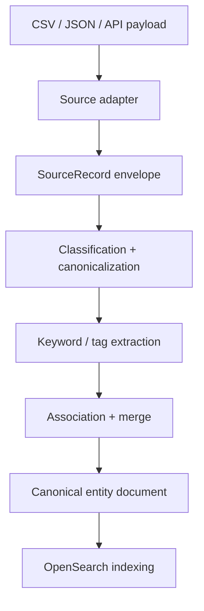

# Platform Expansion Plan

This document captures the next shape of the platform beyond CSV uploads:

- JSON upload via API
- multiple tenants
- export paths
- how all of that fits into the current OpenSearch-backed architecture

It is intentionally a planning document, not an implementation spec. The goal is to keep the
segmentation engine source-agnostic while making storage, search, and export fit cleanly around it.

---

## 1. What stays the same

The core product stays centered on one engine:

- infer field meaning
- canonicalize equivalent fields
- extract tags and keywords
- support multi-value / nested fields
- make fields segmentable and searchable

The source format should not matter to the engine. CSV, JSON, and API payloads should all be
converted into the same internal record representation before canonicalization.

### Core principle

> Source-specific parsing belongs in adapters. Canonicalization, tagging, merging, and indexing
> belong in the platform core.

---

## 2. Source model

Introduce a common record envelope that all ingestion sources emit.

```kotlin
data class SourceRecord(
    val tenantId: String,
    val collectionId: String,
    val sourceId: String,
    val recordId: String? = null,
    val associationKey: String? = null,
    val fields: Map<String, Any?>,
    val meta: Map<String, Any?> = emptyMap(),
)
```

### Source adapters

Each ingestion path becomes a thin adapter:

- CSV adapter
  - parse rows into `SourceRecord`
  - preserve file name and row metadata
- JSON adapter
  - flatten or preserve nested objects depending on field shape
  - preserve arrays and nested maps
- API adapter
  - accept single objects, batches, or NDJSON-like payloads
  - attach request metadata and tenant context

### Supported JSON shapes

The JSON path should support:

- flat objects
- arrays of scalars
- arrays of objects
- nested objects
- mixed records in a batch

The adapter should not decide canonical meaning. It should only preserve structure and emit a
consistent field map for downstream inference.

---

## 3. Canonicalization pipeline

The current pipeline can stay mostly intact if it is fed through a source-neutral envelope.

### Proposed flow



### Things the engine must keep supporting

- scalar fields
- array-valued fields
- labeled arrays, e.g. `{type, value}`
- nested properties
- custom / unknown fields
- association identifiers between records

### Association identifiers

The current collection model already has the idea of a merge key. For multi-source data, that
should become explicit:

- `associationKey` identifies the logical entity across files or sources
- examples:
  - `email` for customer records
  - `company` for account grouping
  - `account_id` for CRM merge keys

This should live at the collection level, with the option to override per source if needed.

---

## 4. OpenSearch layout

OpenSearch should store two conceptual layers:

### 4.1 Raw source layer

Raw source documents keep the original payload and provenance.

Suggested fields:

- `tenant_id`
- `collection_id`
- `source_id`
- `source_name`
- `record_id`
- `association_key`
- `ingested_at`
- `payload`
- `schema_hint`
- `tags`

Purpose:

- audit
- replay
- export
- debugging
- reindexing after rule changes

### 4.2 Canonical entity layer

Canonical entity documents store the merged, searchable representation.

Suggested fields:

- `tenant_id`
- `collection_id`
- `entity_id`
- `association_key`
- canonical fields
- extracted tags
- keyword arrays
- nested multivalue properties
- provenance per field
- segment memberships

Purpose:

- segmentation
- search
- faceting
- enrichment
- export

### Index strategy

There are two practical patterns:

1. Shared index with tenant filters
2. Tenant-prefixed or tenant-dedicated indices

The best fit for the current codebase is:

- start with shared indices
- add mandatory `tenant_id` filtering in all query paths
- add tenant-scoped aliases
- graduate large tenants to dedicated indices later if needed

That keeps operations simple without blocking stronger isolation later.

### Suggested naming

- raw index: `raw_{tenant}_{collection}`
- canonical index: `ent_{tenant}_{collection}`
- alias: `search_{tenant}_{collection}`

For small tenants these can still point at pooled backing indices; the naming just makes the
query path explicit.

---

## 5. Multi-tenancy model

Multi-tenancy should be enforced in three places:

1. authentication / authorization
2. query filtering
3. index selection

### Tenant identity

Tenant identity should come from the authenticated context, not from user-supplied query params.
User input can choose collection, segment, file, or export target, but not the tenant boundary.

### Isolation options

#### Option A: shared index with tenant filter

Pros:

- simpler operations
- fewer indices
- easier to start with

Cons:

- strict discipline required on every query
- less hard isolation

#### Option B: per-tenant or tenant-dedicated indices

Pros:

- better isolation
- cleaner deletes and exports
- easier privilege separation

Cons:

- more operational overhead
- more index management

### Recommended path

Use a hybrid model:

- shared indices for small tenants
- tenant-dedicated indices for larger tenants
- one query contract in the API either way

This keeps the code path stable while allowing storage isolation to evolve behind it.

---

## 6. Export model

Export should be first-class and should not require manual DB access.

### Export targets

- raw source export
- canonical entity export
- segmented export

### Export formats

- CSV for flat views
- JSON for fidelity and API use
- NDJSON for large volumes and streaming

### Export semantics

Exports should always be tenant-scoped and collection-scoped.

Recommended behavior:

- export raw data from the raw layer
- export canonical/searchable data from the entity layer
- apply segment filters in the same query language used for search
- include provenance fields so downstream users can trace where values came from

### Provenance to include

- `tenant_id`
- `collection_id`
- `source_id`
- `source_file`
- `record_id`
- `association_key`
- field source map
- segment labels

### Export API shape

Potential endpoints:

- `GET /api/collections/{name}/export?format=csv&scope=canonical`
- `GET /api/collections/{name}/export?format=json&scope=raw`
- `GET /api/collections/{name}/export?segment=customers`

For large exports, use async job creation and a download URL instead of holding the request open.

---

## 7. How this fits the current app

The current code already has the right seam:

- Kotlin backend owns parsing, canonicalization, and indexing
- React frontend owns query construction and result display
- OpenSearch is the search and storage backend

The next step is to formalize source adapters and metadata so the current dataset / collection
concepts can extend to multiple tenants and multiple source formats.

### Existing concepts to preserve

- canonical fields
- tags
- source file grouping
- association key / merge key
- exact tag search
- semantic keyword search
- generated query visualization

### Concepts to add

- tenant context
- source adapter type
- raw vs canonical indices
- export job
- source record provenance
- JSON payload normalization

---

## 8. Proposed implementation phases

### Phase 1: schema and envelope

- introduce `SourceRecord`
- add source adapter interface
- add JSON adapter alongside CSV
- preserve nested and array values

### Phase 2: tenant context

- add tenant identity to all records
- inject tenant filtering into all query paths
- keep current behavior for single-tenant local dev

### Phase 3: indexing model

- separate raw and canonical document shapes
- add tenant-scoped aliases
- preserve provenance in indexed docs

### Phase 4: export

- canonical CSV export
- raw JSON export
- segmented export
- async export jobs for large datasets

### Phase 5: isolation scaling

- move larger tenants to dedicated indices
- add retention and lifecycle controls
- optional per-tenant quotas and rate limits

---

## 9. Risks and constraints

### 9.1 Query leakage

The main risk with multi-tenancy is accidental cross-tenant query access.

Mitigation:

- tenant identity comes from auth
- server injects tenant filter
- no query path may rely on user input alone for tenant scope

### 9.2 Nested JSON complexity

JSON can introduce deep nesting and large arrays.

Mitigation:

- preserve structure in the raw layer
- normalize only what the canonicalizer can handle
- keep the original payload for replay/export

### 9.3 Export size

Large exports should not be built in memory.

Mitigation:

- stream NDJSON / CSV
- create export jobs for long-running cases
- use OpenSearch pagination or scroll-style retrieval where appropriate

### 9.4 Backwards compatibility

The current CSV flow must not break.

Mitigation:

- keep CSV adapter as the default path
- introduce new adapters beside it
- preserve current search and collection APIs where possible

---

## 10. Suggested near-term order

1. Add `SourceRecord` and `SourceAdapter`
2. Implement JSON upload via API
3. Thread tenant ID through the ingestion and query paths
4. Split raw and canonical indexing concerns
5. Add export endpoints and job handling
6. Introduce tenant-scoped aliases and dedicated-index support for larger customers

---

## 11. Decision summary

The rough architecture should be:

- one source-neutral ingestion envelope
- adapters for CSV, JSON, and API payloads
- a shared canonicalization engine
- OpenSearch as the searchable storage layer
- tenant-scoped query enforcement
- raw and canonical document layers
- exports built off the same filtered query model

This keeps the current engine useful while making room for more input types and stronger
isolation without rewriting the core segmentation logic.

